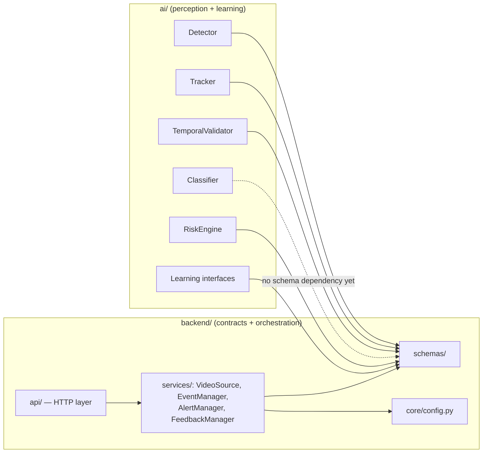

# Component Architecture

**Status: CURRENT.** This document is the map from architectural component → source module → interface, satisfying Task 2 §50's clean-interface requirement.

## Component → module map

| Component (Task 2 §50) | Module | Kind |
|---|---|---|
| `VideoSource` | `backend/services/video_source.py` | `ABC` |
| `Detector` | `ai/detection/interface.py` | `ABC` |
| `Tracker` | `ai/tracking/interface.py` | `ABC` |
| `TemporalValidator` | `ai/temporal/interface.py` | `ABC` |
| `Classifier` | `ai/classification/interface.py` | `ABC` |
| `RiskEngine` | `ai/risk/interface.py` | `ABC` |
| `EventManager` | `backend/services/event_manager.py` | `ABC` |
| `AlertManager` | `backend/services/alert_manager.py` | `ABC` |
| `FeedbackManager` | `backend/services/feedback_manager.py` | `ABC` |
| `SampleSelectionEngine` | `ai/learning/interfaces.py` | `ABC` (FUTURE) |
| `DriftMonitor` | `ai/learning/interfaces.py` | `ABC` (FUTURE) |
| `TrainingManager` | `ai/learning/interfaces.py` | `ABC` (FUTURE) |
| `ModelRegistry` | `ai/learning/interfaces.py` | `ABC` (FUTURE) |

## Shared data contracts

All components communicate through typed Pydantic schemas in `backend/schemas/`, never through ad-hoc dicts:

- `camera.py` — `Camera`, `Zone`, `CameraStatus`
- `detection.py` — `BoundingBox`, `Detection`, `Track`, `TemporalVerdict`
- `event.py` — `Event`, `RiskAssessment`, `RiskLevel`
- `alert.py` — `Alert`, `AlertChannel`, `AlertStatus`
- `feedback.py` — `Feedback`, `FeedbackOutcome`
- `model.py` — `ModelVersion`, `ModelState`, `ModelMetrics`

## Dependency direction



`ai/` depends on `backend.schemas` for typed contracts, but `backend.schemas` never depends on `ai/` — schemas are the stable, shared vocabulary. This is intentional: it lets the AI stack be modified, retrained, or replaced without changing the backend's understanding of what an `Event` is.

## Configuration-driven behavior

No module hard-codes thresholds, weights, tracker choice, or alert policy. Every tunable value is read from `configs/*.yaml` through `backend/core/config.py`:

- `configs/camera.yaml` — cameras + zones
- `configs/video.yaml` — ingestion + frame processing
- `configs/model.yaml` — detector/tracker/classifier selection and thresholds
- `configs/risk.yaml` — temporal thresholds + risk scoring weights
- `configs/alerts.yaml` — risk level → channel policy
- `configs/system.yaml` — app/API/logging/observability

## Package layout (Task 2 update)

```text
AI-CCTV-Sentinel/
├── ai/
│   ├── detection/       interface.py   (Detector)
│   ├── tracking/        interface.py   (Tracker)
│   ├── temporal/        interface.py   (TemporalValidator)
│   ├── classification/  interface.py   (Classifier)
│   ├── risk/            interface.py   (RiskEngine)
│   ├── learning/        interfaces.py  (SampleSelectionEngine, DriftMonitor,
│   │                                     TrainingManager, ModelRegistry)
│   └── training/        (reserved for future training scripts)
│
├── backend/
│   ├── api/             (endpoint implementations — deferred)
│   ├── core/            config.py (settings + YAML loader)
│   ├── database/        (reserved — PostgreSQL is FUTURE)
│   ├── models/          (reserved — ORM models, FUTURE)
│   ├── schemas/         camera.py, detection.py, event.py, alert.py,
│   │                     feedback.py, model.py
│   ├── services/        video_source.py, event_manager.py,
│   │                     alert_manager.py, feedback_manager.py
│   └── middleware/       (reserved — auth/logging middleware, FUTURE)
│
├── configs/             camera.yaml, video.yaml, model.yaml, risk.yaml,
│                         alerts.yaml, system.yaml
├── docs/                 architecture/, api/, research/, diagrams/
└── models/                production/, candidates/, archive/
```
