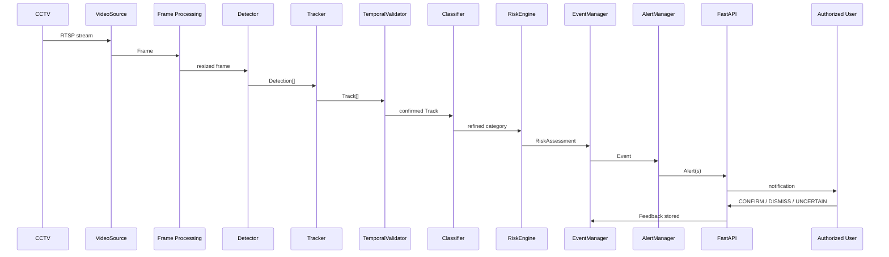

# Data Flow

**Status:** Steps 1-16 are CURRENT (interfaces/schemas defined; not yet wired into a running pipeline beyond the Task 1 skeleton). Steps 17-22 are FUTURE — the architecture accommodates them but no algorithm exists yet.

## Complete flow

1. **CCTV captures frame** — existing camera hardware (FUTURE: real connection).
2. **RTSP transports frame** — standard IP-camera streaming protocol.
3. **Video ingestion receives frame** — `backend.services.video_source.VideoSource.read()` → `Frame`.
4. **Frame processor samples frame** — FPS/size control per `configs/video.yaml`.
5. **YOLO26 detects objects** — `ai.detection.interface.Detector.predict()` → `list[Detection]`.
6. **Tracker assigns track ID** — `ai.tracking.interface.Tracker.update()` → `list[Track]`.
7. **Temporal engine verifies persistence** — `ai.temporal.interface.TemporalValidator.evaluate()` → `TemporalVerdict`.
8. **Classifier refines category** — `ai.classification.interface.Classifier.classify()` (Mode A/B/C).
9. **Risk engine calculates risk** — `ai.risk.interface.RiskEngine.assess()` → `RiskAssessment`.
10. **Event manager creates event** — `backend.services.event_manager.EventManager.create_event()` → `Event`.
11. **Alert manager determines action** — `backend.services.alert_manager.AlertManager.dispatch()` per `configs/alerts.yaml`.
12. **Backend receives event** — FastAPI `/api/v1/events` (contract defined, §"API Contracts").
13. **Event is stored** — logical entity only; PostgreSQL implementation is FUTURE.
14. **User receives notification** — dashboard/mobile/IoT channel (FUTURE delivery, CURRENT contract).
15. **User confirms/dismisses** — `backend.services.feedback_manager.FeedbackManager.submit_feedback()`.
16. **Feedback is stored** — `backend.schemas.feedback.Feedback`.
17. **Active learning selects valuable samples** *(FUTURE)* — `ai.learning.interfaces.SampleSelectionEngine.select_candidates()`.
18. **Drift monitor checks distribution changes** *(FUTURE)* — `ai.learning.interfaces.DriftMonitor.check()`.
19. **Training pipeline creates candidate model** *(FUTURE)* — `ai.learning.interfaces.TrainingManager.start_training_run()`.
20. **Evaluation compares candidate with production** *(FUTURE)* — `ai.learning.interfaces.ModelRegistry.update_metrics()`.
21. **Better candidate is staged/deployed** *(FUTURE)* — `ModelRegistry.promote()`.
22. **Worse candidate is rejected** *(FUTURE)* — `ModelRegistry.reject()`.

## Sequence diagram (steps 1-16, the "current" boundary)

## Step 17-22 detail

See `docs/architecture/self-learning-architecture.md` and `docs/diagrams/05-self-learning-lifecycle.mermaid`.
