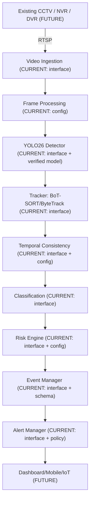

# System Architecture

**Status: CURRENT** — this document describes the architecture as designed in Task 2. Only Task 1's environment foundation is running today; the pipeline itself is interfaces and configuration, not live code.

## 1. Purpose

AI-CCTV Sentinel reuses **existing** campus CCTV infrastructure to detect potentially hazardous animals, verify detections over time to suppress false alarms, assess risk in a zone-aware way, alert the right people through the right channel, and — over time — improve itself using human-verified feedback under a controlled model lifecycle.

## 2. High-level pipeline

See [`docs/diagrams/01-high-level-architecture.mermaid`](../diagrams/01-high-level-architecture.mermaid).



## 3. Layers

| # | Layer | Responsibility | Module | Status |
|---|-------|-----------------|--------|--------|
| 1 | Camera | Camera/zone metadata | `configs/camera.yaml`, `backend/schemas/camera.py` | CURRENT (schema/config only) |
| 2 | Video Ingestion | RTSP connect, reconnect, decode, timestamp | `backend/services/video_source.py` | CURRENT (interface only) |
| 3 | Frame Processing | Resize, FPS control, motion gate | `configs/video.yaml` | CURRENT (config only) |
| 4 | Detection | YOLO26n inference | `ai/detection/interface.py` | CURRENT (interface; model verified in Task 1) |
| 5 | Tracking | BoT-SORT / ByteTrack | `ai/tracking/interface.py` | CURRENT (interface only) |
| 6 | Temporal Consistency | False-alarm suppression | `ai/temporal/interface.py` | CURRENT (interface + config) |
| 7 | Classification | Animal / snake sub-category | `ai/classification/interface.py` | CURRENT (interface only) |
| 8 | Risk Assessment | Zone-aware risk scoring | `ai/risk/interface.py`, `configs/risk.yaml` | CURRENT (interface + config) |
| 9 | Event Manager | Canonical Event contract | `backend/services/event_manager.py` | CURRENT (interface + schema) |
| 10 | Alert Manager | Multi-channel alert routing | `backend/services/alert_manager.py`, `configs/alerts.yaml` | CURRENT (interface + policy) |
| 11 | Backend API | Typed HTTP contracts | `backend/main.py`, §"API Contracts" below | CURRENT (skeleton running, endpoints deferred) |
| 12 | Data Storage | Persistent entities | ER design only | FUTURE (PostgreSQL not implemented) |
| 13 | Human-in-the-Loop | CONFIRM/DISMISS/UNCERTAIN | `backend/services/feedback_manager.py` | CURRENT (interface + schema) |
| 14 | Self-Learning | Active learning, drift, retraining, deployment | `ai/learning/interfaces.py` | FUTURE (interfaces only) |

## 4. Risk Assessment Engine (conceptual formula)

The risk score is a weighted, normalized combination of factors, not a hard-coded verdict:

```text
risk_score = f(
    animal_risk            (configs/risk.yaml: risk.animal_base_risk[class])
  + confidence_factor      (scaled by detection confidence)
  + location_factor        (zone.restricted / zone.student_access)
  + persistence_factor     (track duration / frame count)
  + restricted_zone_factor (extra weight if zone.restricted)
)
```

Weights and per-class base risk live entirely in `configs/risk.yaml`; nothing here is hard-coded in application logic. Score bands (LOW/MEDIUM/HIGH/CRITICAL) are initial engineering defaults, not experimentally validated thresholds — see `docs/research/research-contribution.md`.

## 5. Zone-aware detection

Each camera declares one or more zones (`configs/camera.yaml`). A confirmed track is mapped to `camera_id + zone_id`, and the Risk Engine consults the zone's `restricted` / `student_access` flags when scoring. This lets the same animal class produce a different risk level depending on where it was seen (e.g. a monkey in a restricted store-room vs. an open playground).

## 6. Replaceability (Task 2 §50)

Every layer boundary is a Python `ABC` interface (see `ai/*/interface*.py`, `backend/services/*.py`) operating only on typed schemas (`backend/schemas/`). This means:

- `Detector` can be swapped for a non-YOLO26 model without touching `RiskEngine`, `AlertManager`, backend, or storage.
- `Tracker` can be swapped (BoT-SORT ↔ ByteTrack) without touching the detector.
- `RiskEngine`, `AlertManager`, and downstream components depend only on `backend.schemas.event.Event` — never on detector/tracker internals.

## 7. What is explicitly NOT built yet

Per the Task 2 implementation boundary: no dataset collection, no model training, no PostgreSQL, no Firebase, no MQTT/ESP32, no mobile app, no active-learning algorithm, no drift algorithm, no automatic retraining, no deployment pipeline. These are represented only as interfaces, schemas, and documented data flow.
